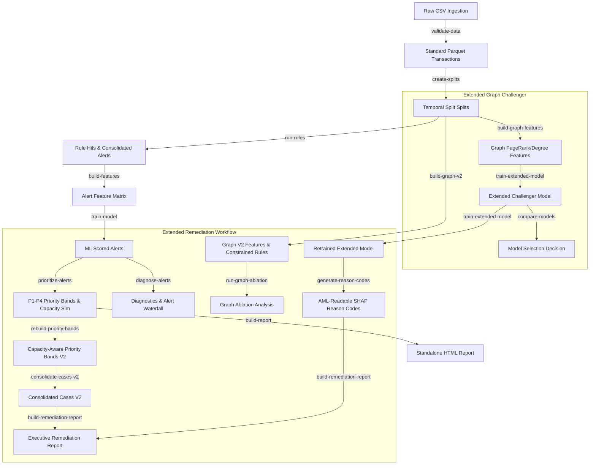

# Anti-Money Laundering (AML) Rules & ML Triage MVP

An end-to-end greenfield system for AML rule development, alert generation, and machine learning-based alert prioritization. 

The architecture follows a dual-layered approach:
1. **Deterministic Rules Engine**: Generates explainable AML alert coverage with high recall.
2. **Machine Learning Classifier**: Ranks generated alerts to prioritize review queues for compliance investigators (with safety guardrails: no auto-suppression or deletion of alerts).

---

## Pipeline Architecture & Data Flow



---

## Quick Start & Environment Setup

This project uses the **Pixi** package manager to guarantee reproducible environments, dependencies, and tasks.

1. **Install Pixi** (if not already installed):
   ```bash
   # Windows (PowerShell)
   iwr -useb https://pixi.sh/install.ps1 | iex
   ```
2. **Initialize Environment**:
   Pixi will automatically fetch dependencies and configure paths:
   ```bash
   pixi run test
   ```

---

## Interactive Jupyter Notebooks

We have implemented two comprehensive, verified notebooks under the `notebooks/` directory to help you explore the data and verify the pipeline:

### 1. [Exploratory Data Analysis (EDA) Notebook](file:///c:/Users/ASUS/Desktop/Code_WorkProject/aml_tm_mvp/notebooks/01_aml_data_eda.ipynb)
Provides a deep dive into the properties of the transaction dataset:
* **Global Statistics**: Profiles the 6.9M rows, temporal ranges, and overall target laundering rate.
* **Class Imbalance**: Illustrates the rare-event laundering label distribution (~0.05% positive rate).
* **Amount Densities**: Compares log-scale transaction amounts for legitimate vs. laundering transfers.
* **Payment Formats**: Analyzes volumes and laundering rates per payment channel (ACH, Cheque, Wire, Cash, Bitcoin).
* **Banking Network Properties**: Plots sender/receiver degree distributions on log-log scales to analyze power-law characteristics and identifies active hubs.

### 2. [ML Triage Walkthrough Notebook](file:///c:/Users/ASUS/Desktop/Code_WorkProject/aml_tm_mvp/notebooks/02_mvp_aml_rules_ml_triage_walkthrough.ipynb)
Walks through the entire rules-to-ml triage lifecycle:
* **Rule Engine Mini-Demo**: Runs the rule engine on a custom toy dataframe to demonstrate the live code API.
* **Triage Performance Evaluation**: Generates **Precision@K** and **Recall@K** curves comparing the Gradient Boosting model against deterministic baselines.
* **Challenger Comparison**: Compares the baseline MVP with a graph-augmented challenger.
* **Workforce Simulation**: Evaluates queue sizes across bands (P1-P4) and models cumulative laundering recall under fixed review capacities.
* **SHAP Explainability**: Decomposes ML risk scores into feature contributions and lists alert reason codes.

---

## Running the Pipeline

You can run individual tasks using Pixi. All commands read from `config/` and write outputs to `data/` and `outputs/`.

Preferred one-command workflows:
```bash
pixi run run-workflow --preset mvp          # Core MVP only
pixi run run-workflow --preset extended     # Extended challenger only, assumes MVP artifacts exist
pixi run run-workflow --preset remediation  # Remediation v2 only, assumes MVP/extended artifacts exist
pixi run run-workflow --preset full         # MVP + extended + remediation in dependency order
```

The default `pixi run run-workflow` uses `--preset full`.

Workflow runs write all child-task logs into one combined file under `outputs/run_logs/`, for example `workflow_full_YYYYMMDD_HHMMSS.log`. You can override the path:
```bash
pixi run run-workflow --preset full --log-file outputs/run_logs/full_refresh.log
```

### 1. Core MVP Workflow
```bash
pixi run validate-data        # Ingest raw CSV and run quality checks
pixi run create-splits        # Manage temporal train/val/test splits
pixi run run-rules            # Execute rules engine (R1-R6 typologies)
pixi run tune-rules           # Optimize numerical rule thresholds
pixi run build-features       # Engineer alert feature matrix
pixi run train-model          # Fit Logistic Regression and Random Forest classifiers
pixi run prioritize-alerts    # Route alerts to P1-P4 queues
pixi run build-report         # Render HTML report and handover manifest
```

### 2. Extended Graph Challenger Workflow
```bash
pixi run extended-stress-test  # LI-only benchmark plus temporal/segment stress checks
pixi run build-graph-features   # Compute PageRank, degree, and cycle features
pixi run run-graph-rules        # Flag graph-specific gather-scatter typologies
pixi run train-extended-model   # Fit LightGBM/XGBoost model incorporating graph metrics
pixi run compare-models         # Audit champion vs challenger and log promotion
pixi run consolidate-cases      # Link alerts into multi-hop cases
pixi run explain-alerts         # Generate SHAP reason codes
pixi run calibrate-scores       # Calibrate probabilities and add risk_score_1000
pixi run build-extended-report  # Build full HTML evidence dashboard
```

### 3. Extended Remediation Workflow
```bash
pixi run diagnose-alerts          # Rule contribution and alert waterfall diagnostics
pixi run rebuild-priority-bands   # Capacity-aware P1-P4 v2 bands with P1 caps/overflow
pixi run build-graph-v2           # Bounded graph v2 features and constrained graph rules
pixi run run-graph-ablation       # Compare MVP-only vs graph feature groups
pixi run train-extended-model     # Retrain extended model with graph v2 features when available
pixi run compare-models           # Refresh MVP vs extended comparison after retraining
pixi run consolidate-cases-v2     # Cap operational cases and write alert-case mapping
pixi run generate-reason-codes    # Map positive/negative SHAP contributors to AML-readable reasons
pixi run build-extended-report    # Refresh extended report after v2 retraining/comparison
pixi run build-remediation-report # Render executive remediation report
```

Run the remediation flow in one command through the same workflow runner:
```bash
pixi run run-workflow --preset remediation
```

`pixi run run-remediation` is kept as a shortcut for the same remediation preset.

Selective runs are available through `run-workflow`:
```bash
python -m aml_mvp.cli run-workflow --preset remediation --steps diagnose-alerts,rebuild-priority-bands
python -m aml_mvp.cli run-workflow --preset full --from-step build-graph-v2
python -m aml_mvp.cli run-workflow --preset full --to-step build-extended-report
```

---

## Directory Layout

* `config/` - Project, data, rule, model, report, and new **Remediation workflow/rules** configurations.
* `src/aml_mvp/` - Core Python package modules:
  - `calibration/` - Contains baseline priority banding and new capacity-aware `band_sizing` algorithms.
  - `cases/` - Contains multi-hop network case linkage and advanced `case_consolidation_v2` with operational capacity limits.
  - `diagnostics/` - New diagnostics suite for alert waterfall profiling.
  - `explainability/` - Model explainability and custom mapping of SHAP features to risk reason codes.
  - `graph/` - Contains cycle detection v2, gather-scatter v2, feature extraction v2, and graph feature group ablation.
  - `reporting/` - Renders HTML reports, charts, tables, and the new executive remediation reports.
* `tests/` - High-coverage pytest unit tests suite (including tests for new remediation components).
* `notebooks/` - Visual walkthroughs and exploratory analysis notebooks.
* `data/` - Target repository for parquet data files (git-ignored, except `.gitkeep` placeholders).
* `outputs/` - Generated metrics, charts, run logs, HTML reports, and remediation artifacts.

---

## Unit Tests

To run the unit tests suite:
```bash
pixi run test
```
The test suite validates data schemas, temporal splits, rule triggers (R1-R6), ML scoring pipeline, priority banding, and calibration logic.

After dependency changes, refresh the Pixi environment first:
```bash
pixi install
```
