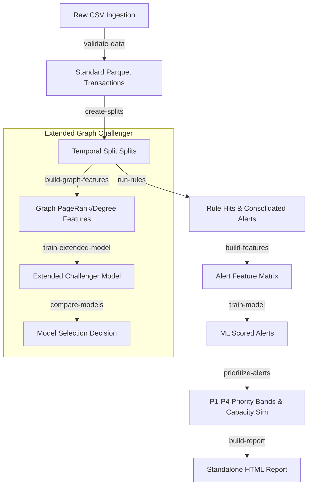

# 🛡️ Anti-Money Laundering (AML) Rules & ML Triage MVP

An end-to-end greenfield system for AML rule development, alert generation, and machine learning-based alert prioritization. 

The architecture follows a dual-layered approach:
1. **Deterministic Rules Engine**: Generates explainable AML alert coverage with high recall.
2. **Machine Learning Classifier**: Ranks generated alerts to prioritize review queues for compliance investigators (with safety guardrails: no auto-suppression or deletion of alerts).

---

## Pipeline Architecture & Data Flow



---

## Quick Start & Environment Setup

This project uses the **Pixi** package manager to guarantee reproducible environments, dependencies, and tasks.

1. **Install Pixi** (if not already installed):
   ```bash
   # Windows (PowerShell)
   iwr -useb https://pixi.sh/install.ps1 | iex
   ```
2. **Initialize Environment**:
   Pixi will automatically fetch dependencies and configure paths:
   ```bash
   pixi run test
   ```

---

## Interactive Jupyter Notebooks

We have implemented two comprehensive, verified notebooks under the `notebooks/` directory to help you explore the data and verify the pipeline:

### 1. 🔍 [Exploratory Data Analysis (EDA) Notebook](file:///c:/Users/ASUS/Desktop/Code_WorkProject/aml_tm_mvp/notebooks/01_aml_data_eda.ipynb)
Provides a deep dive into the properties of the transaction dataset:
* **Global Statistics**: Profiles the 6.9M rows, temporal ranges, and overall target laundering rate.
* **Class Imbalance**: Illustrates the rare-event laundering label distribution (~0.05% positive rate).
* **Amount Densities**: Compares log-scale transaction amounts for legitimate vs. laundering transfers.
* **Payment Formats**: Analyzes volumes and laundering rates per payment channel (ACH, Cheque, Wire, Cash, Bitcoin).
* **Banking Network Properties**: Plots sender/receiver degree distributions on log-log scales to analyze power-law characteristics and identifies active hubs.

### 2. 🛡️ [ML Triage Walkthrough Notebook](file:///c:/Users/ASUS/Desktop/Code_WorkProject/aml_tm_mvp/notebooks/02_mvp_aml_rules_ml_triage_walkthrough.ipynb)
Walks through the entire rules-to-ml triage lifecycle:
* **Rule Engine Mini-Demo**: Runs the rule engine on a custom toy dataframe to demonstrate the live code API.
* **Triage Performance Evaluation**: Generates **Precision@K** and **Recall@K** curves comparing the Gradient Boosting model against deterministic baselines.
* **Challenger Comparison**: Compares the baseline MVP with a graph-augmented challenger.
* **Workforce Simulation**: Evaluates queue sizes across bands (P1-P4) and models cumulative laundering recall under fixed review capacities.
* **SHAP Explainability**: Decomposes ML risk scores into feature contributions and lists alert reason codes.

---

## Running the Pipeline

You can run individual tasks using Pixi. All commands read from `config/` and write outputs to `data/` and `outputs/`.

### 1. Core MVP Workflow
```bash
pixi run validate-data        # Ingest raw CSV and run quality checks
pixi run create-splits        # Manage temporal train/val/test splits
pixi run run-rules            # Execute rules engine (R1-R6 typologies)
pixi run tune-rules           # Optimize numerical rule thresholds
pixi run build-features       # Engineer alert feature matrix
pixi run train-model          # Fit Logistic Regression and GBoost Classifiers
pixi run prioritize-alerts    # Route alerts to P1-P4 queues
pixi run build-report         # Render HTML report and handover manifest
```

### 2. Extended Graph Challenger Workflow
```bash
pixi run build-graph-features   # Compute PageRank, degree, and cycle features
pixi run train-extended-model   # Fit model incorporating graph metrics
pixi run compare-models         # Audit champion vs challenger and log promotion
pixi run run-graph-rules        # Flag graph-specific gather-scatter typologies
pixi run consolidate-cases      # Link alerts into multi-hop cases
pixi run explain-alerts         # Generate SHAP reason codes
pixi run calibrate-scores       # Calibrate probabilities using Isotonic Regression
pixi run build-extended-report  # Build full HTML evidence dashboard
```

---

## Directory Layout

* `config/` - Project, data, rule, model, and report configurations.
* `src/aml_mvp/` - Core Python package modules (Data loading, Rules engine, ML models, Calibration, Graph, Reporting).
* `tests/` - High-coverage pytest unit tests suite.
* `notebooks/` - Visual walkthroughs and exploratory analysis notebooks.
* `data/` - Target repository for parquet data files (git-ignored, except `.gitkeep` placeholders).
* `outputs/` - Generated metrics, charts, run logs, and HTML reports.

---

## Unit Tests

To run the unit tests suite:
```bash
pixi run test
```
The test suite validates data schemas, temporal splits, rule triggers (R1-R6), ML scoring pipeline, priority banding, and calibration logic.
